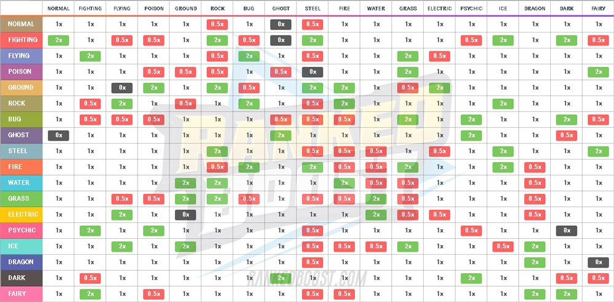
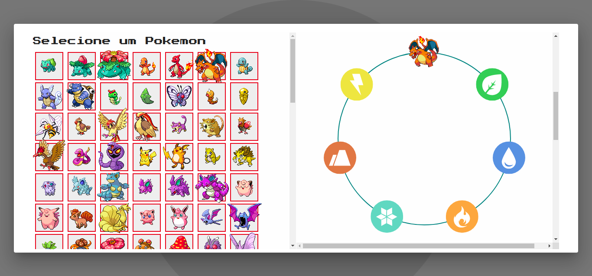

# PAkedex

**Número da Lista**: 1 
**Conteúdo da Disciplina**: Grafos1 

## Alunos
|Matrícula | Aluno |
| -- | -- |
| 15/0120630  |  Caio Oliveira de Moraes |
| 16/0015294  |  Matheus Rodrigues do Nascimento |

## Sobre 
PAkedex é um projeto que ajuda treinadores a escolherem os melhores pokemons para a batalha contra seu oponente. O time adversário é gerado randomicamente. Você pode escolher os pokemons para compor o seu time para a batalha e o PAkedex avalia se o pokemon escolhido será eficaz contra os pokemons do adversário. A ideia do projeto surgiu pois as fraquezas e a eficácia dos tipos de pokemon podem ser representadas pelo grafo direcionado, assim podemos utilizar os grafos para nos dar a eficácia do pokemon. Utilizamos o algoritmo de johnson para mapear todos os ciclos em que o tipo de pokemon aparece para que o usuário possa entender a eficácia e fraqueza do pokemon.  

Também utilizamos a matriz de adjascencia para verificar a eficácia do ataque contra cada um dos pokemons inimigo.

## Screenshots

## Instalação 
**Linguagem**: Typescript 
**Framework**: React 
Para a execução do projeto é necessário ter instalado na máquina o **node** e algum gerenciador de pacote (**yarn** ou **npm**).

Execução:
 
Clone o repositório

`git clone https://github.com/projeto-de-algoritmos/Grafos1_PAkedex` 

Instale as dependências

`yarn ou npm install`

Execute o projeto

`yarn start`

## Uso 
Ao iniciar o projeto o time inimigo é gerado randomicamente, clique no botão de selecionar pokemon para conseguir escolher o pokemon que deseja usar para a batalha contra o inimigo, ao selecionar um pokemon você tera informações sobre se ele é eficaz ou fraco contra o time do adversário.

## Outros 
Quaisquer outras informações sobre seu projeto podem ser descritas abaixo.

